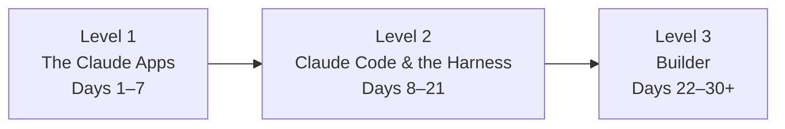

# Curriculum overview

Three levels, one path. Each level assumes the previous one (or equivalent experience),
and every single day ends with something shipped and logged.

## The map

## Level 1 — The Claude Apps (Days 1–7)

No code. The claude.ai surface used the way power users actually use it: Projects and
Memory as persistent context, Artifacts as a build surface, Skills as encoded
standards, Connectors as reach into your real tools, Chrome and Excel as agentic
surfaces — capped by building your first autonomous **loop**.

→ [Start Level 1](level-1/index.md)

## Level 2 — Claude Code & the Harness (Days 8–21)

The mental-model level. What an agent loop actually is, why the harness matters more
than the model, how to manage context like a budget, and the five configuration layers
that turn Claude Code from a chatbot-in-a-terminal into a system: CLAUDE.md, skills,
hooks, subagents, MCP.

→ [Start Level 2](level-2/index.md)

## Level 3 — Builder (Days 22–30+)

Give back to the loop: build with the Agent SDK, publish a skill or MCP server others
can install, run a self-improving loop in production, and write one lesson for this
program — teaching back is the graduation exercise.

→ [Start Level 3](level-3/index.md)

## Official learning resources (use them as milestones)

Anthropic maintains a canonical free curriculum — this program sequences and holds you
accountable; the official material is the source of record:

- [**Anthropic Academy**](https://www.anthropic.com/learn) — ~20 free courses with
  completion certificates, in three tracks. Suggested milestone certificates:
  *Claude 101* after Level 1 · *Claude Code 101* / *Claude Code in Action*, *Agent
  Skills*, *Introduction to MCP*, and *Subagents* during Level 2 · the Agent SDK
  material for Level 3. Post each certificate in your log.
- Official GitHub repos, in the order the docs themselves recommend:
  [anthropics/courses](https://github.com/anthropics/courses) (API fundamentals — note:
  older material) → [anthropics/claude-cookbooks](https://github.com/anthropics/claude-cookbooks)
  (copy-able recipes) → [anthropics/skills](https://github.com/anthropics/skills)
  (the Agent Skills spec + templates) →
  [anthropics/claude-quickstarts](https://github.com/anthropics/claude-quickstarts)
  (deployable app templates).
- [How usage limits work](https://support.claude.com/en/articles/11647753-how-do-usage-and-length-limits-work)
  — one shared usage pool across claude.ai, Claude Code, Desktop, and Cowork (a 5-hour
  rolling window plus a weekly cap; API billed separately). Learn this on Day 1; it's
  the top source of new-user confusion.

!!! tip "The ecosystem moves fast"
    Pages state facts "as of mid-2026" and link official docs rather than restating
    them. A [weekly review loop](../colophon.md) checks for drift. If you hit something
    that changed, that's a curriculum bug — open an issue; fixing it is a contribution.
